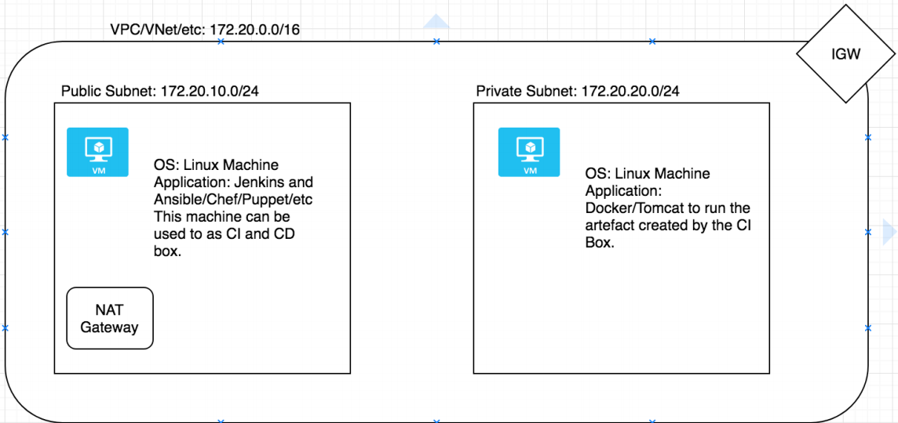

# Let's do - Part:1

Sample code can be reffered and used as a basic building block to

* Provision AWS infrastructure by using terraform
* CI/CD with declarative pipe-line on Jenkins and 
* Deploy the code on remote server 

Let's start with our first activity -
Here is the infrastructure diagram which will be provisioned by the terraform code

* Generate your AWS access and secret key, store them in `~/.aws/credentials` on your machine
* Please generate the PEM file from AWS console, define the path of it  in variable.tf  under `key_path` and name under `ec2_key` an AWS.This PEM file will be used to connect to both EC2 instances 

The keys can be used in more secure ways by implementing different mechanisms. However let's keep this task simple and clean 

The `remote-exec` will execute  `tools.sh` file on the Jenkins server which resides on public network. This script will install openjdk-8, git ,maven and provison standalone Jenkins.

##### Second activity:

Since the infrastructure and Jenkins(on public subnet) are ready to be used,let's configure Jenkins server with user, install the required plugins. 

Create a pipe-line job in Jenkins, and copy the `Jenkinsfile` into it.
The Jenkinsfile has 3 stages which includes our 3rd activity(Deploy artifacts on remote server) 

* Checkout - Checkout the code from a sample repository https://github.com/spring-projects/spring-petclinic
* Build the code (locally) with maven and 
* deploy the code on public subnet server by using Ansible 

